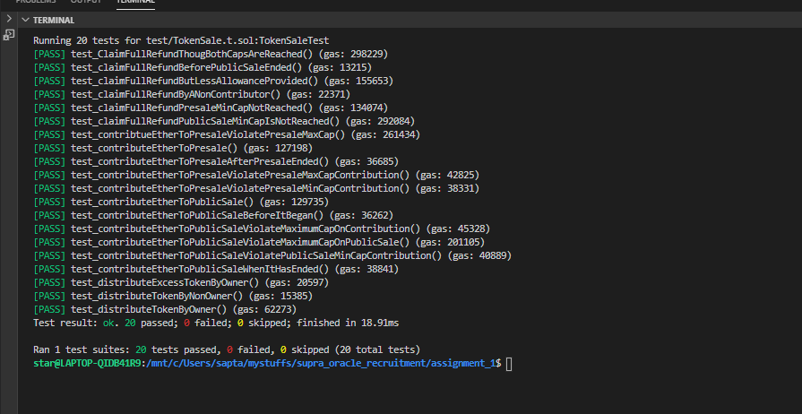

# Token Sale Smart Contract

## Introduction

This is a Solidity smart contract for conducting a token sale in two phases: a presale and a public sale. It enables contributors to exchange Ether for project tokens. The smart contract includes features such as contribution limits, token distribution, and refund functionality based on the minimum cap.

## Design Choices

- To reduce redundancy and modularize the code, the logic for transferring ERC20 project tokens to users is consolidated in the `_executeTokenPurchase` function.
- For simplicity and clarity, a fixed conversion rate from Ether to tokens is used instead of a dynamic adjustment.
- All essential variables are set during contract deployment and cannot be changed afterward. If different caps are needed, a new contract should be deployed.
- The constructor includes multiple `require` checks to prevent deploying the contract with invalid values, such as public sale timing before presale timing.
- Refund functionality is designed to exchange ERC20 tokens for Ether. Users need to provide an equal amount of ERC20 tokens according to the conversion rate. Refunds for amounts different from the user's total contributions (presale + public sale) are not supported. This approach helps maintain the core logic of updating user's contribution to presale and public sale which is later reduced to zero, on refund
- The contract uses a fixed reserve for project tokens instead of dynamic minting to ensure predictable token supply and prevent coin flooding.

## Security Considerations

- The contract leverages the `Ownable` contract from OpenZeppelin instead of manually defining the `onlyOwner` modifier, which enhances security and reliability.
- When transferring ERC20 tokens from the contract to a user, the contract verifies that it holds a sufficient reserve of tokens. If not, the transaction will fail, ensuring the contract's solvency.
- During refunds, two crucial checks are performed: the user must have enough project tokens in their account, and they must grant sufficient allowance. This prevents unauthorized refunds and ensures proper token handling.
- SafeMath operations are used to prevent overflow and underflow vulnerabilities in arithmetic operations.
- The constructor includes `require` checks to prevent the deployment of a flawed contract with invalid parameters, enhancing the contract's security.

## Test Case

- Test cases can be found in `TestCases.yml` file in `YML` format, it is written as a YML List format to ensure readability. Here is an example

```yml
- TestCaseId: 1
  TestDescription: A customer contributes ether to the presale with a valid amount.
  Expected: The contract balance should increase, and the customer's address should receive ProjectToken.
```

- TestCaseId is the serial number of test case
- TestDescription provides comprehensive description of testcase
- Expected provides the expected output of the testcase

## Test Case Execution Result



## Features

### Presale:

- Users can contribute Ether to the presale and receive project tokens.
- Maximum cap on total Ether raised.
- Minimum and maximum contribution limits per participant.
- Immediate token distribution upon contribution.

### Public Sale:

- Public sale begins after the presale ends.
- Users can contribute Ether to the public sale and receive project tokens.
- Maximum cap on total Ether raised.
- Minimum and maximum contribution limits per participant.
- Immediate token distribution upon contribution.

### Token Distribution:

- Owner-exclusive function to distribute project tokens to a specified address.

### Refund:

- Contributors can claim refunds if the minimum cap for the presale or public sale is not reached.

## Requirements

- Implement the smart contract in Solidity.
- Use the ERC-20 standard for the project token.
- Incorporate proper error handling and event logging.
- Ensure the smart contract adheres to security best practices.
